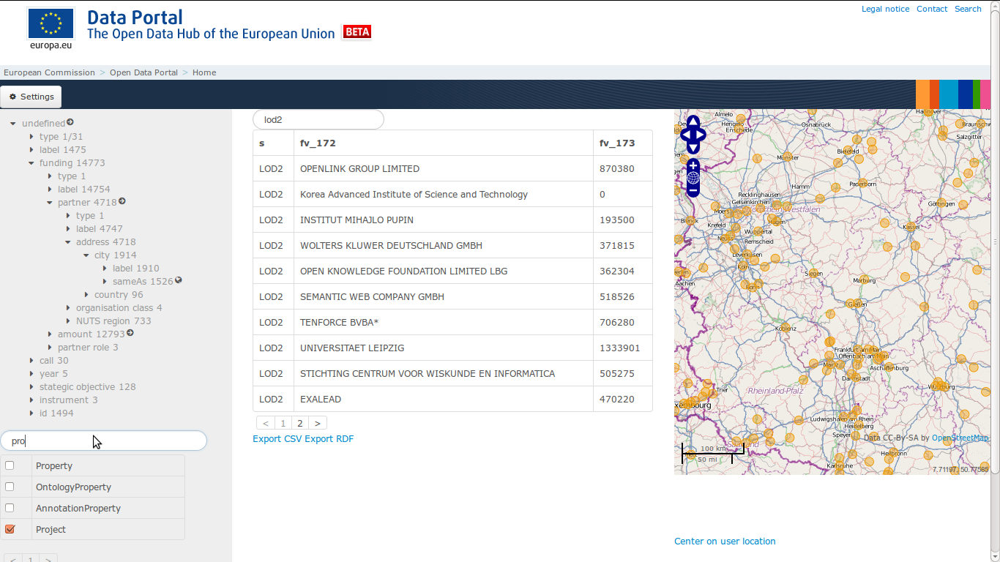

# Welcome to Facete - Slice 'n' Dice RDF data explorer!

___Discontinued Repository - Development continues with Facete2 [here](https://github.com/GeoKnow/Facete2)___

This repository contains the first version of Facete which was finished at the beginning 2014 and deployed at the [European Open Data Portal](http://open-data.europa.eu/) under the name [SemMap](http://open-data.europa.eu/semmap/).

Facete offers out-of-the-box faceted search over SPARQL endpoints.
Current features:
* Slicing and Dicing: Filter RDF data by any property / dimension
* Hierarchical facets: Constrain the facets of another facet's values using a simple tree structure. Pivoting made easy!
* Freely link facets to table columns (using the arrow-right icon)
* Freely link facets to a map view (using the glob icon)

Limitations:
* At the moment facete always queries for the exact facet / facet value counts. Therefore, Facete may not work with low selective facet selections on large datasets.

## Architecture
This project is comprised of the following modules
* facete-client: This is a pure JavaScript code base (+ index.php) offering faceted search on SPARQL endpoints.
* facete-server: This is a server module providing additional services to the client - although the client can be run without them. At the moment these services are CSV and RDF export for the facet selection.

## Configuration
Note: This section explains how the configuration should work for the release.

### facete-client
Check out the repository, and follow these steps

    git checkout devel

    # Create local copies of any .dist file in the repo, and adjust the content appropriately
    # (This has to be done manually right now, read section below)

    # Make the client known to your webserver, e.g:
    # NOTE Adjust the following line as needed
    ln -s <project-root>/facete-client/src/main/webapp /var/www/facete

Open a browser and check whether you can see the Facete application under [http://localhost/facete].

You also need to have PHP and curl for PHP installed:

    sudo apt-get install php5 php5-curl

Although the client is functional without any configuration (you can e.g. set which SPARQL endpoint to explore in the user interface - NOTE: this is currently bugged!), you most likely want to adjust some default values:

    cd <project-root>/facete-client/src/main/webapp/resources
    cp facete-config.js.dist facete-config.js
    cp facete-index.properties.dist facete-index.properties

Now adjust the settings in `facete-config.js` as needed according to the comments in that file, for example:

    config.sparqlServiceIri = 'http://fp7-pp.publicdata.eu/sparql';
    config.sparqlDefaultGraphIris = ['http://fp7-pp.publicdata.eu/'];
    config.sparqlProxyServiceIri = 'lib/SparqlProxyPHP/current/sparql-proxy.php'; // For PHP-based proxying
    config.sparqlProxyServiceIri = 'api/sparql-proxy'; // For Java-based proxying (intended for inside the Tomcat container)

Note to Tenforce: Activate the appropriate theme by adjusting `facete-index.properties`:

    facete.themePath=facete-themes/odp3

### facete-server
TO BE DONE
Currently some settings can be adjusted via the the index.php.

## Building a WAR for Facete
IMPORTANT: Make sure to have `facete-config.js` and `facete-index.properties` configured appropriately, as these files will become part of the .war file.

    # Under <repository-root>
    mvn clean install

    # Afterwards, run this:
    cd facete-server
    mvn clean war:war

    # The result artifact is now under <module-root>/target/facete-server-<version>.war
    targetFile=`ls -1 target | grep 'facete-server.*\.war'`

    # Do something with the target file...

    # Note: If you set up tomcat and maven according to the quick guide below,
    # you can deploy to tomcat directly using

    # Under <repository-root>/facete-server
    mvn clean tomcat7:redeploy

    # Note, that you can overwrite the tomcat-server-id and tomcat-deploy-url attributes:
    mvn tomcat7:redeploy -Dtomcat-server-id=tomcat-demo -Dtomcat-deploy-url=http://demo.host.com:8080/manager/text

Facete should now run under <http://localhost:8080/facete-server/welcome.do>.

### Tomcat Quick Installation Guide (for Debian/Ubuntu)
The following steps will get you going with a working Tomcat. Use at your own risk.

Install Tomcat (and of course jdk + maven)

    sudo apt-get install openjdk-7-jdk maven
    sudo apt-get install tomcat6 tomcat6-admin
    
    # Setup for tomcat7 is broken right now
    sudo apt-get install tomcat7 tomcat7-admin

Configure a tomcat user: 

    /etc/tomcat7/tomcat-users.xml

    <tomcat-users>
        <!-- Add and adjust the following snipped to this section. -->

        <role rolename="admin-gui"/>
        <role rolename="admin-script"/>

        <role rolename="manager-gui"/>
        <role rolename="manager-script"/>

        <user username="username" password="password" roles="manager-gui,manager-script,admin-gui,admin-script"/>

    </tomcat-users>

Configure Maven to know the password

Edit 

    ~/.m2/settings.xml

Note: The file may not exist yet.

    <settings xmlns="http://maven.apache.org/SETTINGS/1.0.0"
            xmlns:xsi="http://www.w3.org/2001/XMLSchema-instance"
            xsichemaLocation="http://maven.apache.org/SETTINGS/1.0.0
                          http://maven.apache.org/xsd/settings-1.0.0.xsd">
            <servers>
                    <server>
                            <!-- Note: The id must match one of those declared in the pom.xml (tomcat-localhost is defined) -->
                            <!-- I do not understand why maven does not allow to configure the server's URL here :s -->

                            <id>tomcat-localhost</id>
                            <!-- Note: username and password must match that of the tomcat user -->
                            <username>username</username>
                            <password>password</password>
                    </server>
            </servers>

    </settings>

## Licence
The source code of this repo is published under the [Apache License Version 2.0](LICENSE)

